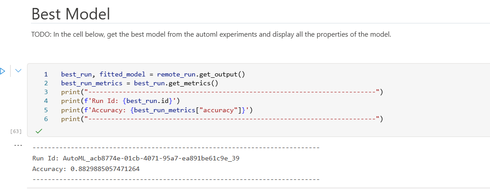
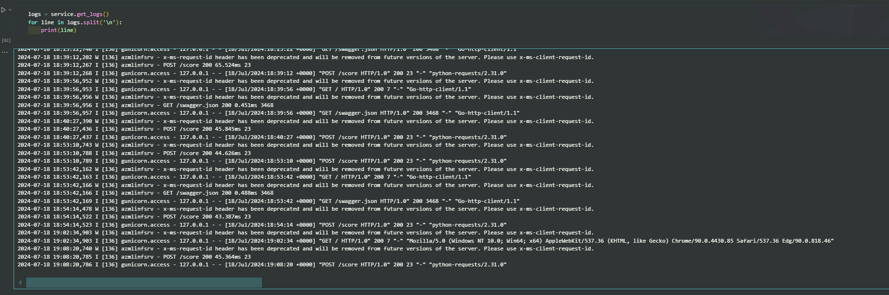

# Capstone: Hearth Failure Prediction using AzureML

## Table of contents
- [Capstone: Hearth Failure Prediction](#capstone-hearth-failure-prediction)
    - [Overview](#overview)
    - [Project Set Up and Installation](#project-set-up-and-installation)
    - [Architect diagram](#architect-diagram)
    - [Dataset](#dataset)
    - [Overview](#overview)
    - [Task](#task)
    - [Access](#access)
    - [Automated ML](#automated-ml)
    - [Results](#results)
    - [Hyperparameter turning](#hyperparameter-tuning)
    - [Results](#results)
    - [Model Deployment](#model-deployment)
    - [Screen Recording](#screen-recording)
    - [Standout Suggestions](#standout-suggestions)
    - [Reference](#reference)

## Overview
This is the capstone project of the Udacity Azure for Machine Learning Nanodegree.

In this project, we are forcusing on deploying the model endpoint to predict the Hearth failure, we used the both AutoML and Hyperparameter turning to train the data and find the best model among them. Once we have the best model, we will use it to deploy the model endpoint and consume it to predict patient's survival based on the collected patient data.

## Project Set Up and Installation

Before start the project, we need setup the environment on the local env to match with the AzureML

- Install python (prefer: python >= 3.9)
- Download anaconda
- Clone the repo
- We have two directories, auoml and turning, in the each directory we have the `env.yml` file
- Run the env using the command: `conda env create --file env.yml`
- Run the jupite notebook

Or we can attach the project on the AzureML and run the project.

## Architect diagram

- Register the dataset: I have already writen the script to automate register the `Heart Failure dataset` on Data Assert of Azure ML
- Provison the VMSS: I have writen the script to automate provison the Virtual Machine Scale Set to make the ENV and schedule jobs for training and turing the model.
- AutoML: using the AutoML to train data and find the best model
- Hyperparameter turning: using the HyperDrive to tuning the model and return the best model and the best parameters for traing model.
- Find the best model: compare models from both methods and register the best model on AzureML
- Deploy Model Endpoint: the Best Model is deployed using ACI, with Application Insight enabled to monitor the ACI
- Consume the model endpoint: use the model endpoint to predict the patient's survival.

## Dataset
### Overview
Dataset from Davide Chicco, Giuseppe Jurman, the dataset we will train is provided here.

We analyzed a dataset containing the medical records of 299 heart failure patients collected at the Faisalabad Institute of Cardiology and at the Allied Hospital in Faisalabad. The patients consisted of 105 woman and 194 men, and their ages between 40 and 95 year old. 

The dataset contains 13 feature:

Feature | Explanation | Measurement | Range
------------ | ------------- | ------------- | ------
 Age |  Ageofthepatient | Years | [40, ...,95]
 Anaemia | Decreaseofredbloodcellsorhemoglobin | Boolean | 0,1
 High blood pressure | Ifapatienthashypertension | Boolean | 0,1
 Creatinine phosphokinase | Level of the CPK enzymein the blood | mcg/L | [23, ...,7861]
 Diabetes | If the patient has diabetes | Boolean | 0,1
 Ejection fraction | Percent age of blood leaving the heart ateach contraction | Percentage | [14, ...,80]
 Sex | Woman or man | Binary | 0,1
 Platelets | Platelets in the blood | kiloplatelets/mL | [25.01, ...,850.00]
 Serum creatinine | Level of creatinine in the blood | mg/dL | [0.50, ...,9.40]
 Serumsodium | Level of sodium in the blood | mEq/L | [114, ...,148]
 Smoking | If the patient smokes | Boolean | 0,1
 Time | Follow-upperiod | Days | [4,...,285]
 (target)deathevent | If the patient died during the follow-upperiod | Boolean | 0,1

### Task
In this project, we will find the best classification algorithm method using AutoML of AzureML service of Azure Cloud. At the same time, we also use the Hyperparameter turing to find the best parameter for Random Forest Algorithm as well as find the best model.  

### Access
We will register the Hearth Failure dataset in the Data assest of AzureML portal


## Automated ML

AutoML: Automated machine learning, also referred to as automated ML or AutoML, is the process of automating the time-consuming, iterative tasks of machine learning model development. It allows data scientists, analysts, and developers to build ML models with high scale, efficiency, and productivity all while sustaining model quality. 

#### AutoML config:
Configration | Details | Value
------------ | ------------- | -------------
`compute_target` | Azure ML compute target to run the AutoML experiment on | compute_target
`task` | The type of task task to run, set as classification | classification
`training_data` | The training data to be used within the experiment contains training feature and a label column | Tabular Dataset
`label_column_name`	| The name of the label column | 'label'
`enable_early_stopping` | Enable AutoML to stop jobs that are not performing well after a minimum number of iterations	| True
`featurization` | Config indicator for whether featurization step should be done autometically or not	| auto
`debug_log ` | The log file to write debug information to | 'automl_errors.log'
`enable_onnx_compatible_models` | AutoMl automate create the onnx model  | True

#### Additional Auto ML setting:

Configration | Details | Value
------------ | ------------- | -------------
`experiment_timeout_minutes` | Maximum amount of time in hours that all iterations combined can take before the experiment terminates | 20
`max_concurrent_iterations` | Represents the maximum number of iterations that would be executed in parallel | 5
`primary_metric` | The metric that the AutoML will optimize for model selection | accuracy


### Results
The AutoML trained and tested many models, this return the `Voting Ensemble` Algorithm is the best model, and it has `accurracy over than 88%`.

1. Using python SDK to show the detail training.
    

1. The script return the best model
    

1. The bets model is Voting Ensemble
    

1. Overview: the Voting Ensemble algorithm achived the highest accuracy a score of 0.88
    

1. Metric:
    

## Hyperparameter Tuning

I have tried several models at [data_processing.ipynb](/dataset/data_processing.ipynb), and I see that the `RandomForestClassifier` has the highest acurracy among the models

For this project, I use the Bayesian sampling, which is based on the Bayesian optimization algorithm. It picks samples based on how previous samples did, so that new samples improve the primary metric, so it suitable to explore the larger search space.

<h4>BayesianParameterSampling:</h4>

Configration | Details | Range
------------ | ------------- | -------------
`n_estimators` | The number of trees in the forest  | choice(100,200,300,400)
`max_depth` |  The maximum depth of the tree | quniform(10,200,1)
`min_samples_leaf` | The minimum number of samples required to be at a leaf node | quniform(1,15,1)
`criterion` | The function to measure the quality of a split. Supported criteria are “gini” for the Gini impurity and “log_loss” and “entropy” both for the Shannon information gain  | choice("gini", "entropy", "log_loss")

### Results
After the HyperDrive is completed, we found the best model like bellow

``` txt
Run Id: HD_a1b1510f-e316-4d0b-8eeb-71abae1d9577_69
Accuracy: 0.8380952380952381
N estimators: 200
Max depth: 175
Min sample leaf: 5
Criterion: entropy
```

1. Using python SDK to show the detail turing model
    

1. Using script return the best model
    

1. The list model were turned and the top model is the best model when already finish turning
    

1. The best model achived the highest accuracy a score of 0.88
    


## Model Deployment
In the project, I have used two method to find the best models, I see that the Voting Ensemble model of AutoML has higher accurracy than model of hyperparameter turning.

Voting Ensemble 

### Deploy and testing 
1. Using python SDK and writing script to automate deploy the model endpoint with Voting Ensemble model.
    

1. The model endpoint is running
    

1. Test using python to call model endpoint and it is working well
    

### Use the model endpoint
1. We copy the REST endpoint and Primary key, and use with the tool such as Postman or write the script to call the model endpoint, example [endpoint.py](./test/endpoint.py)
    

1. We run the `endpoint.py` file and the result like bellow
    


## Screen Recording
https://youtu.be/UrJDv6ngNrY?si=svGT8PJ4eTOWfKzg

## Standout Suggestions

Enable the log of Application Insight:
```py
aci_config = AciWebservice.deploy_configuration(
    cpu_cores=1.8, 
    memory_gb=2, 
    enable_app_insights=True, # it help application insight can investigate and log the model endpoint.
    auth_enabled=True
)
```

Result:



## Reference
[Machine learning can predict survival of patients with heart failure from serum creatinine and ejection fraction alone](https://bmcmedinformdecismak.biomedcentral.com/articles/10.1186/s12911-020-1023-5)

[What is AzureML (Microsoft learn)](
https://learn.microsoft.com/en-us/azure/machine-learning/concept-automated-ml?view=azureml-api-2)